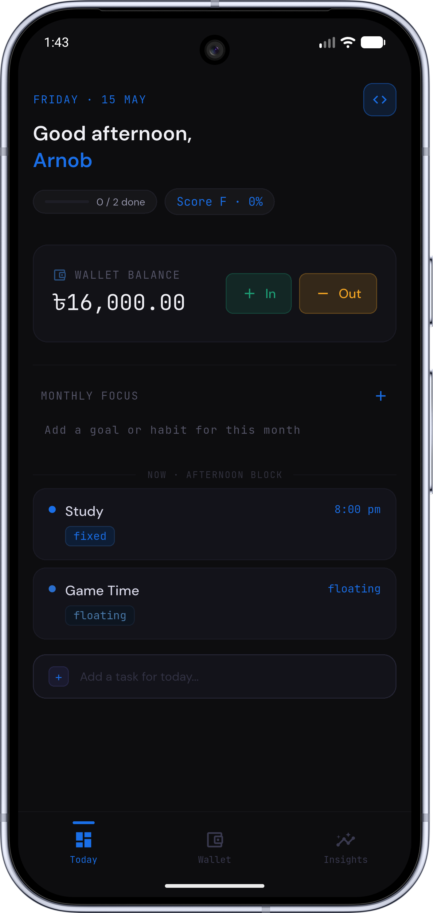
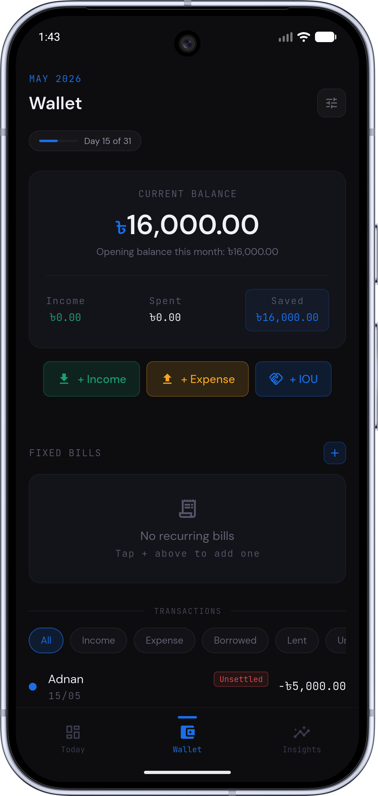
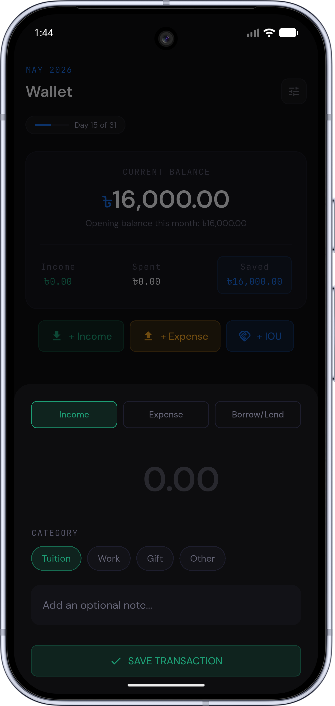

<p align="center">
  
</p>

<h1 align="center">Momentum</h1>

<p align="center">
  A personal daily routine, habit, and finance tracker for Android.
</p>

<p align="center">
  <a href="#-download">
    
  </a>
  &nbsp;
  
  &nbsp;
  
  &nbsp;
  
</p>

---

Momentum helps you structure your day through scheduled task blocks, track your finances month by month, and reflect on your performance with end-of-day logging and weekly analytics — all stored privately on your device.

---

## 📸 Screenshots


<p align="center">
  
  
  
  
  
</p>


---

## ✨ Features

### 🗓️ Today (Dashboard)
- Personalized greeting with time-aware salutation
- Live progress pill and animated health score
- Wallet summary card with inline income/expense logging
- Monthly Focus — scrollable goal and habit chip strip with daily reminders
- Task list grouped by time block (Morning · Afternoon · Evening)
- Task cards with expand-to-act: mark done, skip, or reschedule
- Collapsible completed tasks and quick-add for ad-hoc tasks

### 💰 Wallet
- Running monthly balance with opening balance carry-forward
- Log income (tuition / freelance / other) and expenses (fixed / variable / borrowed / lent)
- Monthly budget progress bar with over-budget warning
- Semester savings goal tracker
- Full transaction history for the current month

### 📊 Insights
- Weekly health score ring with animated arc and letter grade (A–F)
- Energy bar chart (Mon–Sun) from end-of-day logs
- 35-day consistency heatmap with score-based color intensity
- Income vs. Spend bar chart
- Budget discipline indicator

### 🌙 End-of-Day Log
- Triggered via the **Close Day** button after 9 PM
- Logs energy level, motivation, budget adherence, and free-text notes
- Calculates a health score from task completion weighted by type
- Displays a read-only summary card if today is already logged

### 🔧 Routine Builder
- 7-column weekly planner (Mon–Sun)
- Task types: **Fixed** (exact time), **Floating** (flex window), **Adhoc** (one-off)
- Per-task settings: duration, buffer time, Do Not Disturb toggle

### 🔔 Background & System
- Scheduled notifications for task reminders and EOD prompt
- Auto Do Not Disturb during tasks with DND enabled
- Android home screen widget — shows current task, next task, and daily progress
- WorkManager periodic refresh keeps the widget live without opening the app
- Automatic month rollover carrying wallet balance forward

---

## 📥 Download

> **The app is not yet on the Play Store.** You can download the latest APK directly from GitHub Releases.

1. Go to the [**Releases**](../../releases) page.
2. Download the latest `momentum-release.apk`.
3. On your Android device, allow installation from unknown sources if prompted (**Settings → Apps → Special app access → Install unknown apps**).
4. Open the downloaded APK and install.

Requires **Android 5.0 (API 21)** or higher.

---

## 🔒 Privacy

All your data stays **on your device**. Momentum uses no cloud sync, no account, and no internet connection. Everything is stored locally using [Hive](https://pub.dev/packages/hive).

---

---

## 🛠️ Developer Guide

Everything below is for contributors and developers who want to build or modify Momentum.

### Prerequisites

- [Flutter SDK](https://docs.flutter.dev/get-started/install) (stable channel, 3.x)
- Android Studio or VS Code with the Flutter & Dart extensions
- Android device or emulator (API 21+)

### Getting Started

```bash
# 1. Clone the repo
git clone https://github.com/your-username/momentum.git
cd momentum

# 2. Install dependencies
flutter pub get

# 3. Generate Hive type adapters
dart run build_runner build --delete-conflicting-outputs

# 4. Run in debug mode
flutter run

# 5. Build a release APK
flutter build apk --release
```

The release APK will be at `build/app/outputs/flutter-apk/app-release.apk`.

### Tech Stack

| Layer | Library |
|---|---|
| UI | Flutter + Material 3 |
| State | Riverpod |
| Storage | Hive (offline, no cloud) |
| Notifications | flutter_local_notifications + timezone |
| Home Widget | home_widget + WorkManager |
| Charts | fl_chart |
| Fonts | Google Fonts (DM Sans + JetBrains Mono) |

### Project Structure

```
lib/
├── constants/       # Avatar icon list
├── models/          # Hive data models + generated adapters
├── providers/       # Riverpod state providers
├── repositories/    # Hive box access layer
├── screens/
│   ├── dashboard/   # Today tab
│   ├── wallet/      # Wallet tab
│   ├── insights/    # Insights tab
│   ├── log/         # EOD log screen
│   ├── profile/     # Profile & settings
│   ├── routine/     # Routine builder
│   └── onboarding/  # First-launch flow
├── services/        # Notifications, DND, widget sync, health score
├── theme/           # AppColors, AppTypography
└── widgets/         # Shared UI components

android/
└── app/src/main/kotlin/com/example/daily_tracker/
    ├── MainActivity.kt
    ├── DailyTrackerWidgetProvider.kt  # RemoteViews home screen widget
    ├── WidgetRefreshWorker.kt         # WorkManager periodic refresh
    └── BootReceiver.kt                # Re-schedules worker on boot

packages/
└── flutter_dnd/     # Local plugin for Do Not Disturb control
```

### Data Storage

All data is stored locally on-device using Hive. No account, no cloud sync.

| Box | Contents |
|---|---|
| `routineTasks` | Weekly routine task templates |
| `dailyTaskInstances` | Per-day task instances |
| `eodLogs` | End-of-day performance logs |
| `transactions` | Wallet income and expense records |
| `monthSummaries` | Monthly financial rollup |
| `walletSettings` | Budget limit and semester savings goal |
| `userSettings` | Name, avatar, first-launch flag |
| `simple_goals` | Monthly focus goals and habits |

---

## 🤝 Contributing

Contributions are welcome! Here's how to get involved:

1. **Fork** the repository and create your branch from `main`:
   ```bash
   git checkout -b feature/your-feature-name
   ```
2. **Make your changes** — keep commits focused and descriptive.
3. **Test** on a real device or emulator before submitting.
4. **Open a Pull Request** with a clear description of what you changed and why.

### Reporting Bugs

Please [open an issue](../../issues) and include:
- Your Android version and device model
- Steps to reproduce the bug
- What you expected vs. what happened
- Screenshots or logs if available

### Suggesting Features

Open an issue with the `enhancement` label and describe the feature and the problem it solves.

---


## License

[MIT](LICENSE) © 2026 Shaswata Das
